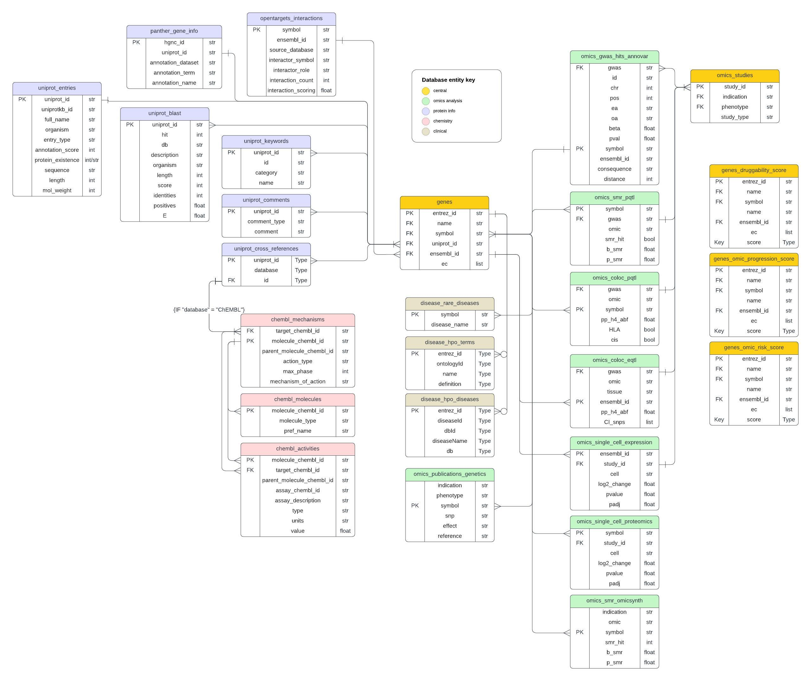

# Neuron23's Target Selection Dashaboard

## Overview
This Streamlit dashbaord display's results from Neuron23's DS Target Selection Pipeline (see [repository](https://github.com/neuron23-ds/target-selection-pipeline)). Please refer to the dashboard's "About" section for instructions on features.

## Data
Data for the dashboard is store on a Google Storage Bucket, [target-selection-pipeline/db](https://console.cloud.google.com/storage/browser/target-selection-pipeline/db).  This set of csv files has been formatted into a relational database which is represented by the ERD below. A data dictionary can be found on the storage bucket.

.